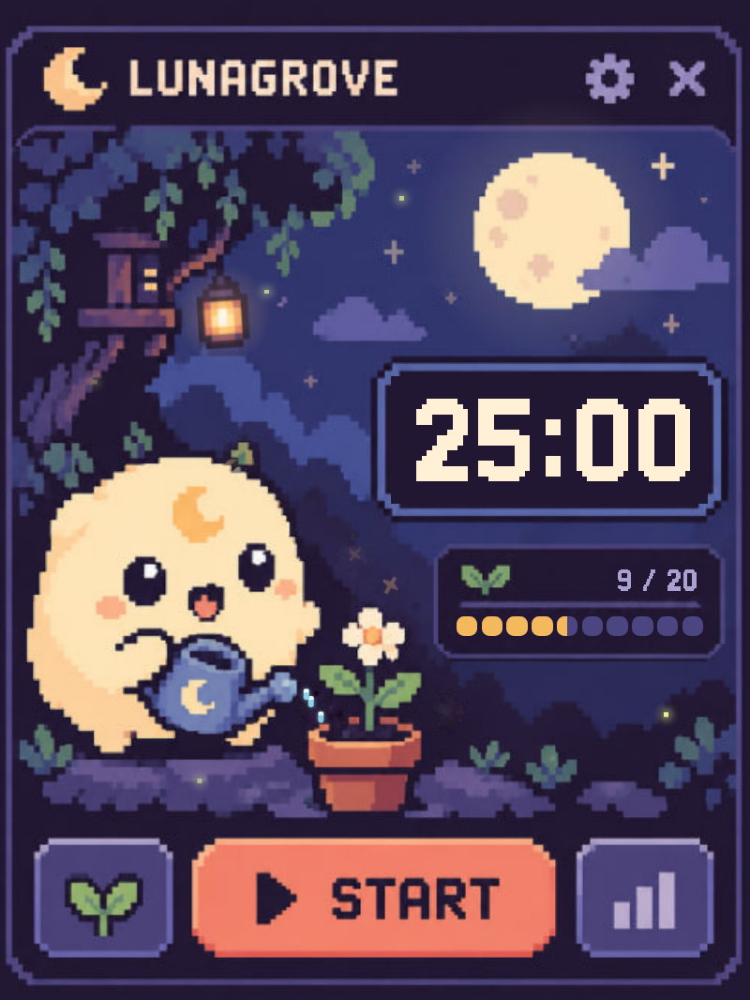
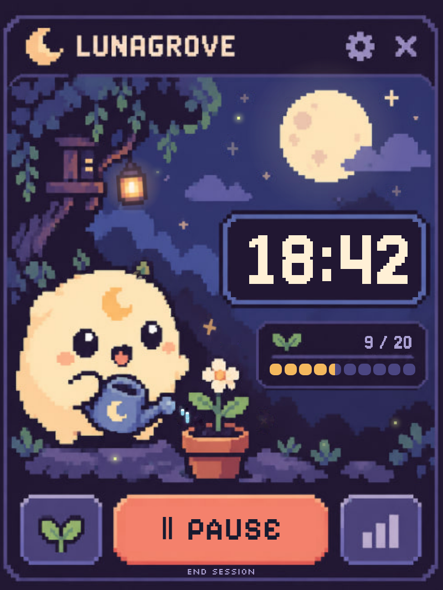
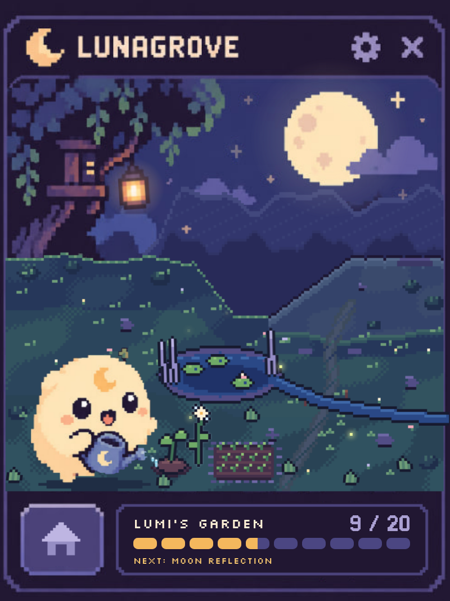
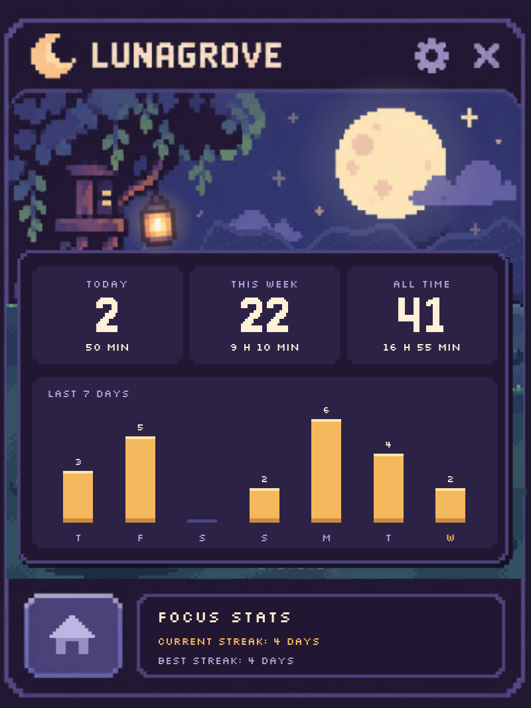
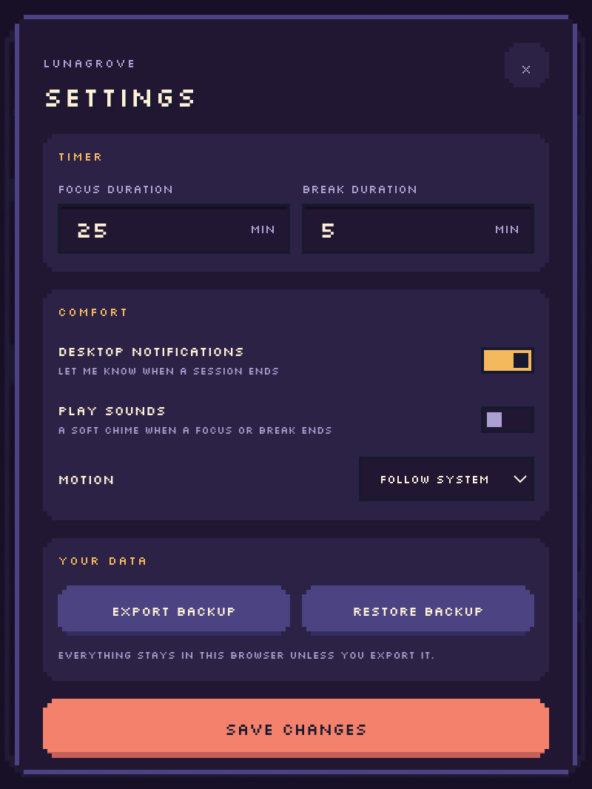
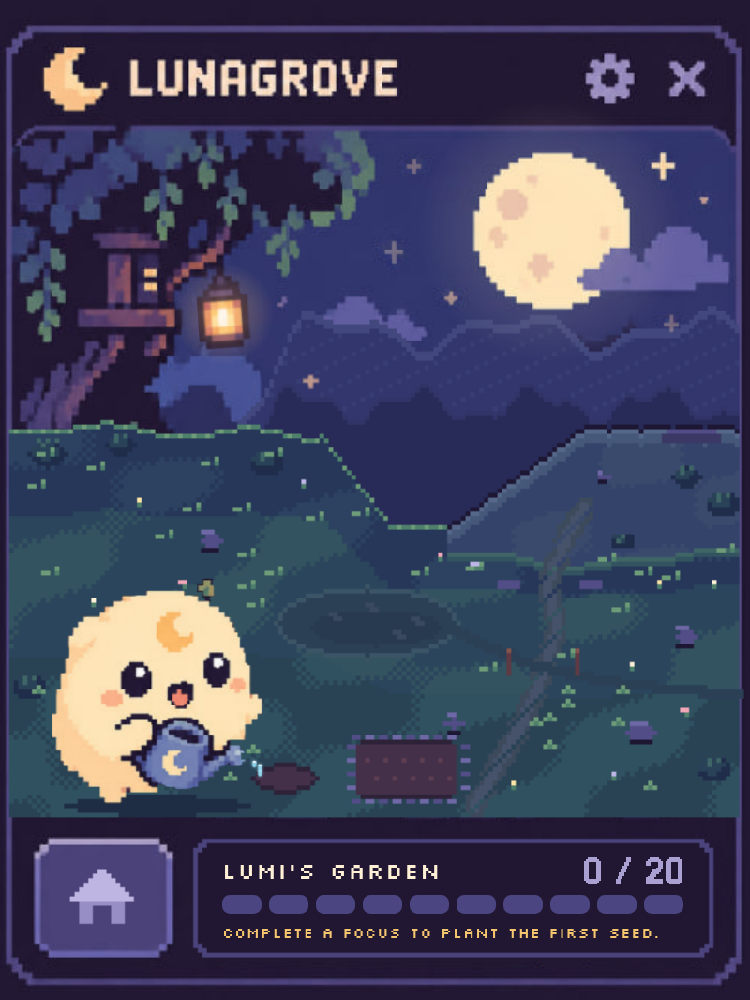
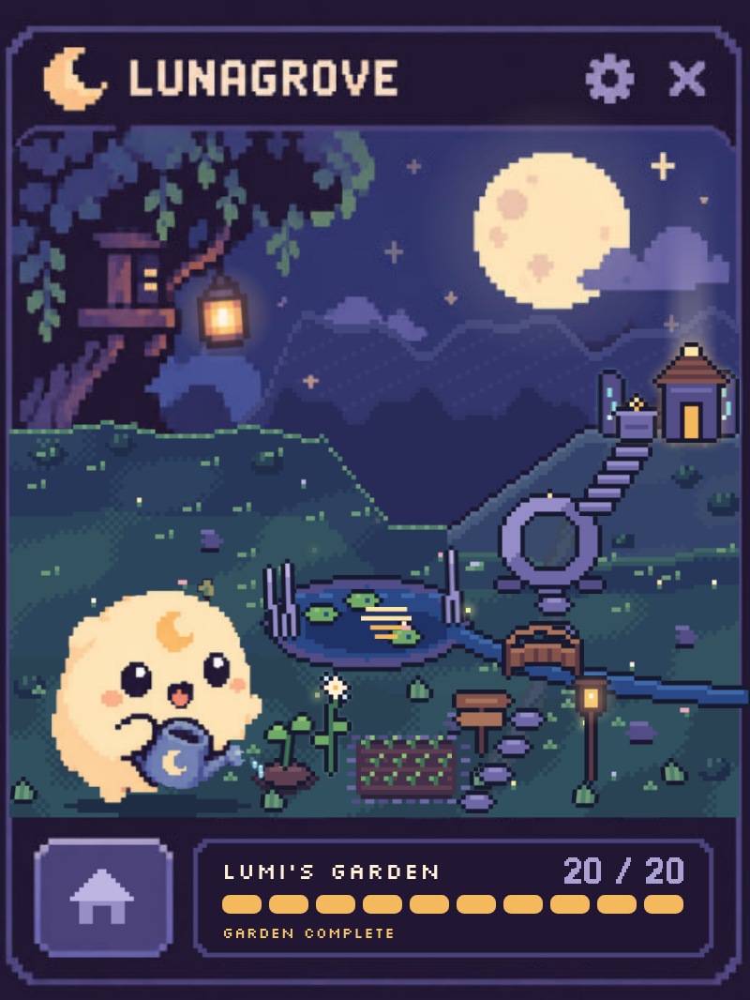

<div align="center">
  

  # Lunagrove

  **A gentle pixel-art Pomodoro that turns focused time into a growing moonlit garden.**

  <p>
    
    
    
    
  </p>

  Focus. Grow. Return. No streak anxiety, no neglected pet, no punishment for taking a break.
</div>

---

<div align="center">
  
  <br />
  <sub>The home screen: Lumi waters her flower while the timer waits for you.</sub>
</div>

## A quick tour

<table align="center">
  <tr>
    <td align="center"><br /><sub>Focusing</sub></td>
    <td align="center"><br /><sub>The garden, growing</sub></td>
    <td align="center"><br /><sub>Focus stats</sub></td>
    <td align="center"><br /><sub>Settings</sub></td>
  </tr>
</table>

## Meet Lumi

Lumi is a small moon spirit who cares for Lunagrove while you focus. Every completed Pomodoro moves the journey forward, fills the garden with another permanent detail, and brings the grove closer to its lunar shrine.

Lunagrove is built around a simple idea: **productivity should feel inviting, not demanding**. Progress never regresses, and Lumi will never shame you for leaving.

## What works today

| Feature | What it does |
|---|---|
| Reliable Pomodoro | Start, pause, resume, cancel, and complete focus or break sessions. |
| Persistent timer | Chrome alarms keep sessions running after the popup closes, and sessions interrupted by a browser restart are recovered. |
| Growing garden | Every completed focus plants one permanent piece of Lumi's garden. |
| Focus stats | Today, this week, all time, the last seven days, and your current and best streaks. |
| Gentle alerts | An optional notification and a short 8-bit chime when a session ends. |
| Local-first data | Preferences, progress, and statistics stay in Chrome storage. |
| Personal settings | Adjust focus and break durations, sounds, notifications, and motion. |
| Backup and restore | Export your grove and safely import it again later. |
| Living pixel scenes | Lumi breathes and blinks, stars twinkle, the lantern sways, and fireflies drift. Reduced motion stills everything. |

## The twenty-step journey

Each completed focus session unlocks one permanent detail:

| Sessions | Chapter | Milestone |
|:--:|---|---|
| `1–5` | **Sprout** | Seed, first leaves, flower, grass, and a garden patch. |
| `6–10` | **Pond** | Water, lily pads, reeds, fireflies, and moonlight. |
| `11–15` | **Bridge** | A path, bridge, lantern, traveler marker, and moon gate. |
| `16–20` | **Shrine** | Steps, runes, altar, shrine light, and the lunar shrine. |

<table align="center">
  <tr>
    <td align="center"><br /><sub>Before the first focus</sub></td>
    <td align="center"><br /><sub>Twenty focus sessions later</sub></td>
  </tr>
</table>

The newest piece pops into place every time you open the garden.

## Try it locally

### Requirements

- [Node.js](https://nodejs.org/) 20 or newer
- [pnpm](https://pnpm.io/)
- Google Chrome or another Chromium-based browser

### Development preview

```bash
git clone https://github.com/BrisaTielly/lunagrove.git
cd lunagrove
pnpm install
pnpm dev
```

Open the local URL printed by Vite, usually:

```text
http://127.0.0.1:5173/src/popup/index.html
```

### Load it as a real Chrome extension

```bash
pnpm build
```

Then:

1. Open `chrome://extensions`.
2. Enable **Developer mode**.
3. Select **Load unpacked**.
4. Choose the generated `dist/` directory.
5. Pin Lunagrove and open it from the extensions toolbar.

Running the unpacked extension is the best way to test alarms, notifications, persistence, and popup lifecycle behavior.

## Commands

| Command | Purpose |
|---|---|
| `pnpm dev` | Start the Vite development server. |
| `pnpm build` | Type-check and create the production extension in `dist/`. |
| `pnpm test -- --run` | Run the complete Vitest suite once. |
| `pnpm test:watch` | Run tests in watch mode. |
| `pnpm run typecheck` | Check TypeScript without creating a build. |

## Built with

- **React 19** and **TypeScript** for the popup experience.
- **Vite** and **CRXJS** for the Manifest V3 build.
- **Chrome Alarms, Storage, Notifications, and Offscreen APIs** for extension behavior.
- **Web Audio** for the chime, synthesized in code with no audio files.
- **Vitest** and **Testing Library** for domain and interface tests.
- Original pixel-art assets, sprite layers, and custom grid-rendered timer digits.

<details>
  <summary><strong>Why does Lunagrove request these permissions?</strong></summary>

  - `storage` keeps your timer preferences, progress, and local statistics.
  - `alarms` allows an active session to finish reliably after the popup closes.
  - `notifications` optionally tells you when focus or rest time is complete.
  - `offscreen` plays the optional end-of-session chime while the popup is closed.

  Lunagrove has no account system and does not require a remote backend for the current MVP.
</details>

## Roadmap

- [x] Reliable focus and break timer
- [x] Pause and resume across popup sessions
- [x] Persistent local progress and statistics
- [x] Settings, notifications, backup, and restore
- [x] Animated Lumi home scene
- [x] Growing Garden view
- [x] Focus stats (in place of the planned Journey Map)
- [x] End-of-session chime
- [ ] Completion and rest celebrations
- [ ] Final extension icons (provisional ones ship today) and Chrome Web Store assets
- [ ] Chrome Web Store release

## Contributing

Lunagrove is still growing. Bug reports, accessibility improvements, pixel-art polish, tests, and focused feature proposals are welcome.

Before opening a pull request:

```bash
pnpm test -- --run
pnpm run typecheck
pnpm build
```

Please keep the product's core promise intact: **gentle progress without punishment**.

---

<div align="center">
  <strong>Made under moonlight with tiny pixels and patient focus.</strong>
  <br />
  <sub>Lumi will keep the watering can ready.</sub>
</div>
